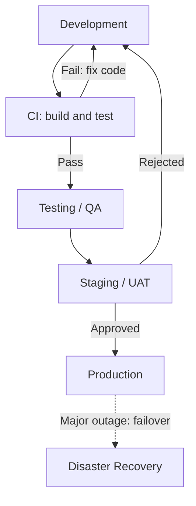

# DevOps exercises 1 and 2

Based on the uploaded course PDF, pages 8 and 9. The solutions below are proposed answers. Only local verification has been performed; the GitHub Actions runs must be performed in your own repository.

## Exercise 1: design the environments

**Company:** ShopMX, a fictional online store that sells electronics.

**Goal:** validate changes before customers use them and recover service after a major outage.

| Environment | Who uses it | What data it holds | Who can deploy |
| --- | --- | --- | --- |
| Development | Developers | Synthetic products, users and orders | Developers |
| Testing / QA | QA engineers and automated tests | Controlled synthetic datasets and anonymized samples | CI service account after automated checks |
| Staging / UAT | QA, operations and product owner | Anonymized production-like data; test-mode payments | Release pipeline, initiated by an authorized release engineer |
| Production | Customers and operations | Real accounts, orders and transactions | Protected release pipeline after product-owner approval |
| Disaster Recovery (DR) | Operations team during recovery or drills | Encrypted backups and replicated production data | Recovery automation operated by authorized operations staff |

Staging also hosts UAT. The product owner checks business requirements there but does not deploy code. DR is justified because an unavailable store loses orders and must be able to restore service and data. The DR setup is a warm standby that is scaled up during recovery; failover and restoration must be rehearsed.



Build a candidate once in CI, then promote the same versioned artifact through QA, staging and production. Environment-specific configuration is supplied separately. This diagram is the proposed release design; exercise 2 implements only CI, not deployment or recovery.

**Trade-off: cost vs production similarity.** Staging uses the same software versions and infrastructure definitions as production, but fewer instances and anonymized data. This lowers cost while preserving useful functional checks. Smaller staging cannot fully reproduce peak-load behavior, so temporarily scale it for performance tests before important releases.

**Presentation script:**

"We chose ShopMX, an online store. Developers work with synthetic data in development, and QA validates changes in a separate testing environment. Staging supports final checks and user acceptance testing. Production contains real customer data and requires release approval. We also include disaster recovery to restore service after a major outage. Our trade-off is a smaller staging environment to reduce cost, with temporary scaling for performance tests. The same build artifact moves through QA, staging and production."

## Exercise 2: build your first pipeline

### What the app does

The app calculates a price after a percentage discount. Its single unit test checks that a 10% discount on $100 returns $90. It uses Node.js's built-in test runner and has no third-party dependencies.

The workflow keeps `actions/checkout@v4`, `actions/setup-node@v4` and Node.js 20 from the course PDF. The application was verified locally on Node.js 24; the hosted runner uses the configured Node.js 20.

### Files included

- `src/app.js`: discount function and a console demonstration.
- `tests/app.test.js`: one unit test.
- `scripts/build.js`: copies the JavaScript app into `dist/app.js`; no transpilation is needed.
- `package.json`: start, test and build commands.
- `package-lock.json`: committed lockfile required by `npm ci`.
- `.github/workflows/ci.yml`: GitHub Actions workflow.
- `.gitignore`: excludes generated files.
- `LOCAL_VERIFICATION.txt`: observed local pass/fail/pass results.

### 1. Verify locally

Install Git and Node.js first if they are missing. Extract the ZIP and open a terminal inside the `devops-lab` directory.

```bash
npm ci
npm start
npm test
npm run build
```

Expected app output: `Final price: $90.00`. The test passes, and the build creates `dist/app.js`.

### 2. Create the repository and push

Create an empty GitHub repository called `devops-lab`, without adding a README, license or gitignore. Replace `YOUR_USERNAME` below with your GitHub username. Authenticate to GitHub when Git asks.

```bash
git init
git add .
git commit -m "Add app, unit test and CI workflow"
git branch -M main
git remote add origin https://github.com/YOUR_USERNAME/devops-lab.git
git push -u origin main
```

Open the repository's Actions tab and select the CI run. Confirm that `npm ci`, `npm test` and `npm run build` succeed. Do not upload the ZIP itself to the repository; push its extracted contents, including `.github/workflows/ci.yml`.

### 3. Break the test on purpose

In `tests/app.test.js`, replace this line:

```js
assert.equal(applyDiscount(100, 10), 90);
```

with:

```js
assert.equal(applyDiscount(100, 10), 80);
```

Then push the change:

```bash
git add tests/app.test.js
git commit -m "Demonstrate a failing test"
git push
```

In Actions, confirm the red run. The test reports actual `90`, expected `80`. Its nonzero exit code fails the job, so the following build step is skipped. The intentionally wrong expected value demonstrates the CI failure mechanism; the correct business rule remains $90.

### 4. Fix the test

Restore the expected value to `90`, then push:

```bash
git add tests/app.test.js
git commit -m "Restore the correct expected discount"
git push
```

Confirm the new Actions run turns green. Keep evidence of all three hosted runs: green, red and green.

### Explain each step

| Step | Purpose |
| --- | --- |
| Push / pull request | Starts CI automatically |
| Checkout | Retrieves repository code |
| Setup Node | Selects the Node.js runtime |
| npm ci | Installs exactly from the committed lockfile |
| npm test | Checks the discount behavior; fails the job if the test fails |
| npm run build | Packages the app after the test passes |

**Presentation script:**

"Our application calculates discounts. A push or pull request triggers GitHub Actions. The workflow downloads the code, sets up Node.js, installs dependencies, runs the unit test and builds the app. The first run should pass. Then we deliberately change the expected result from ninety to eighty, causing the test to fail and the build to be skipped. Finally, we restore the correct expected result, so the next run should pass. This demonstrates automatic validation of code changes."

Use "passed", "failed" and "passed again" in the script only after you have observed those results in GitHub Actions. The included verification log records local results only.

### Sources

- Uploaded PDF: DevOps: Origins, Environments and CI/CD, exercises on pages 8 and 9.
- https://docs.github.com/en/actions/tutorials/build-and-test-code/nodejs
- https://nodejs.org/api/test.html
